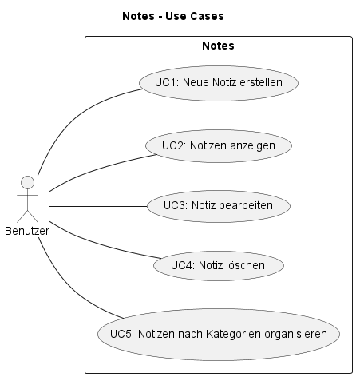
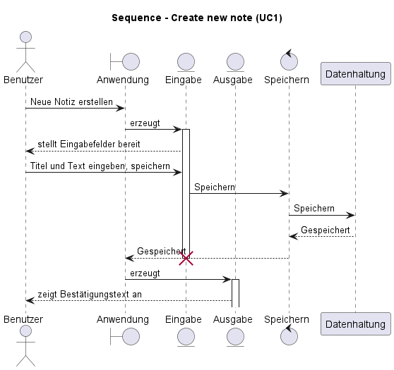
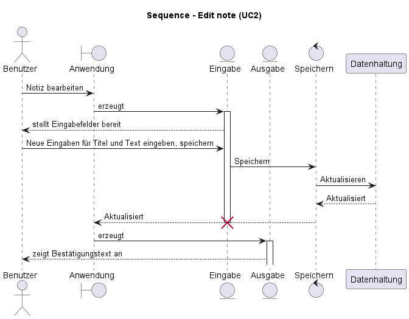
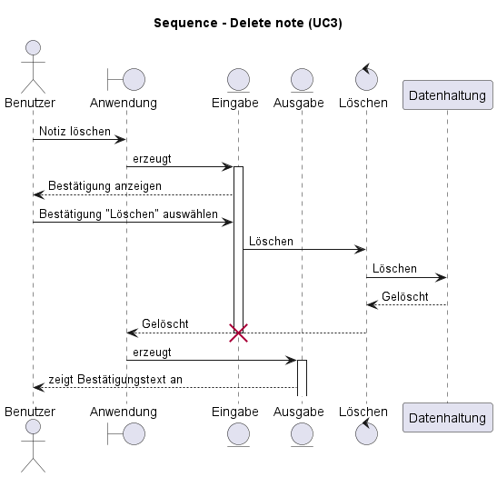
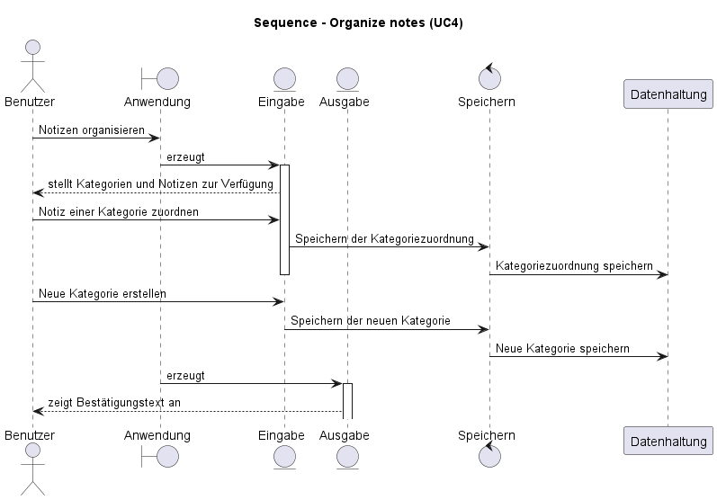
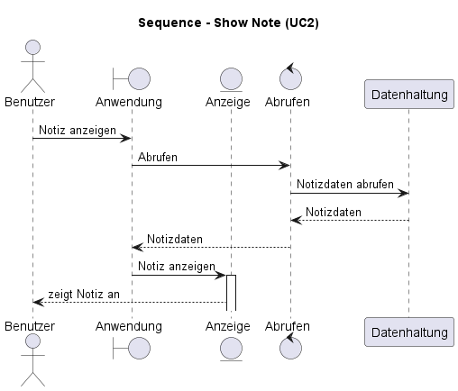
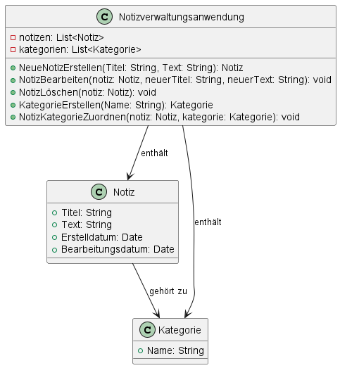

# bsun-notes

Übungsprojekt [Notiz-Verwaltungsanwendung](https://confluence.sageinternal.de/display/SGSHOP/Notiz-Verwaltungsanwendung).

- [bsun-notes](#bsun-notes)
  - [Use Cases](#use-cases)
    - [UC1: Neue Notiz erstellen](#uc1-neue-notiz-erstellen)
    - [UC2: Notizen anzeigen](#uc2-notizen-anzeigen)
    - [UC3: Notiz bearbeiten](#uc3-notiz-bearbeiten)
    - [UC4: Notiz löschen](#uc4-notiz-löschen)
    - [UC5: Notizen nach Kategorien organisieren](#uc5-notizen-nach-kategorien-organisieren)

## Use Cases

Es wird eine Liste der vorhandenen Notizen und Kategorien angezeigt, und der Benutzer kann durch Klicken auf eine Notiz den Inhalt anzeigen oder bearbeiten. Die Benutzeroberfläche ermöglicht auch das Erstellen neuer Notizen und Kategorien und das Löschen von Notizen. Die Notizen werden lokal auf dem Gerät des Benutzers gespeichert, sodass er jederzeit auf sie zugreifen und sie verwalten kann.

### UC1: Neue Notiz erstellen

Der Benutzer kann die Anwendung öffnen und eine neue Notiz erstellen, indem er einen Titel und den Text der Notiz eingibt. Die Notiz wird dann in einer lokalen Datei gespeichert.

### UC2: Notizen anzeigen

### UC3: Notiz bearbeiten

Benutzer können vorhandene Notizen öffnen und den Titel oder den Text der Notiz bearbeiten. Nach der Bearbeitung kann die aktualisierte Notiz gespeichert werden.

### UC4: Notiz löschen

Wenn der Benutzer eine Notiz nicht mehr benötigt, kann er sie aus der Liste der Notizen löschen. Die Anwendung löscht dann die entsprechende Notiz aus der lokalen Datei.

### UC5: Notizen nach Kategorien organisieren

Benutzer können verschiedene Kategorien erstellen, um ihre Notizen zu organisieren. Zum Beispiel können sie Kategorien wie "Persönlich", "Arbeit", "Einkaufsliste" usw. erstellen und Notizen entsprechend zuordnen.

